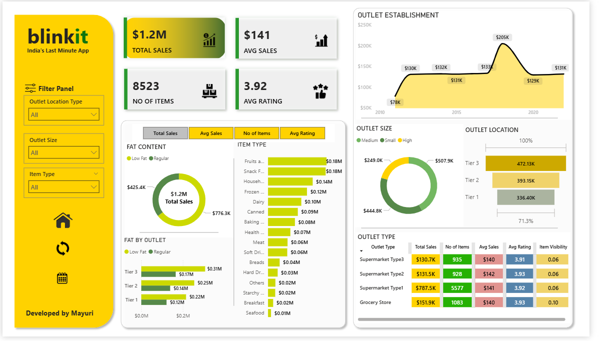

# 🛒 Blinkit Grocery Insights Dashboard

## Project Overview
This project, the Blinkit Grocery Insights Dashboard, is an interactive data visualization and analytics solution. It is designed to provide a deep dive into Blinkit's grocery sales performance, customer behavior, and outlet-level metrics. The dashboard allows users to explore data across multiple dimensions, including product type, outlet size and location.

## Purpose & Goal 🎯
The primary purpose of this dashboard is to empower business analysts, retail managers, and strategists. By providing a comprehensive view of sales and operational performance, the tool helps to identify key revenue drivers, evaluate outlet performance, and optimize product placement and inventory management. The ultimate goal is to transform raw transactional data into actionable business intelligence.

## Technical Stack 📊
This dashboard was developed using a robust suite of tools and technologies for data analysis and visualization:
- **Power BI Desktop**: The core platform for creating the dashboard visuals.  
- **SQL**: Used for calculating key performance indicators (KPIs), cleaning data, and complex transformations.  
- **Power Query**: Employed for data preprocessing and fixing inconsistencies (e.g., standardizing "LF" to "Low Fat").  
- **DAX (Data Analysis Expressions)**: Utilized to create custom measures and dynamic visualizations.  
- **File Formats**: The final project includes the `.pbix` dashboard file, a `.csv` dataset, and a `.pptx` presentation.  

## Data Source 📂
The dashboard is built on a comprehensive dataset from Blinkit's grocery sales, provided as a `.csv` file. Key columns in the dataset include:
- Item Fat Content  
- Item Identifier  
- Item Type  
- Outlet Establishment Year  
- Outlet Identifier  
- Outlet Location Type  
- Outlet Size  
- Outlet Type  
- Item Visibility  
- Item Weight  
- Total Sales  
- Rating  

## Key Features & Business Insights 📈

### Business Problem
While Blinkit generates millions in sales, a clear understanding of performance drivers was hidden within raw transactional data. This dashboard addresses critical business questions:  
- Which product categories generate the highest sales?  
- How do outlet size and type influence sales performance?  
- What are the trends in customer ratings across various outlets?  
- Which locations (Tier 1, 2, 3) are the most profitable?  

### Dashboard Overview
  

### Dashboard Walkthrough
The dashboard is designed with a clear, intuitive layout. Key visuals include:
- **KPIs Overview (Top Section):** A quick glance at top-level metrics such as Total Sales, Average Sales per item, Number of Orders, and Average Customer Rating.  
- **Sales by Item Fat Content:** A visual comparing revenue from Low Fat vs. Regular items.  
- **Sales by Item Type:** A chart highlighting top-performing categories like Fruits, Frozen Foods, and Soft Drinks.  
- **Sales by Outlet Size:** A chart identifying the performance of Small, Medium, and High-sized outlets.  
- **Sales by Outlet Location Type:** A chart revealing the sales contribution from Tier 1, Tier 2, and Tier 3 cities.  
- **Outlet Type vs Sales:** A chart that breaks down sales across different Outlet Types.  
- **Ratings Distribution:** A visualizer for customer satisfaction across outlets and product categories.  

### Business Impact
The dashboard has delivered powerful insights that can drive strategic decisions:  
- **Customer Preference:** Regular items slightly outperform Low Fat products in terms of revenue.  
- **Outlet Strategy:** Medium-sized outlets demonstrate stronger sales performance, which can inform future expansion plans.  
- **Location Advantage:** Tier 3 outlets contribute a surprisingly significant share of total revenue, highlighting a key market opportunity.  
- **Product Categories:** Staples like Fruits and Frozen Foods dominate sales, while niche categories may benefit from targeted promotional campaigns.  
- **Customer Ratings:** High ratings suggest strong customer satisfaction, but category-level analysis helps pinpoint areas for specific improvements.  

## Future Improvements 🚀
To further enhance the dashboard's capabilities, the following features are planned:  
- Incorporate time-series analysis to track sales trends over multiple years.  
- Add profit margin calculations to provide a more accurate assessment of business profitability.  
- Integrate predictive analytics to enable sales forecasting and proactive inventory management.  
